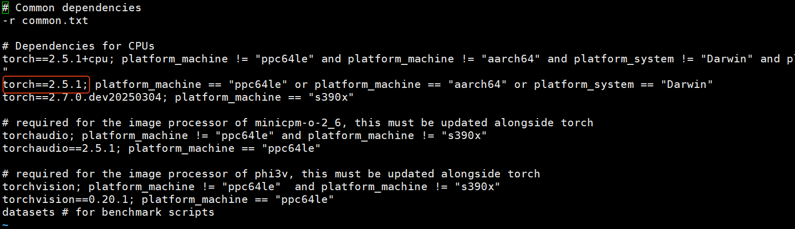
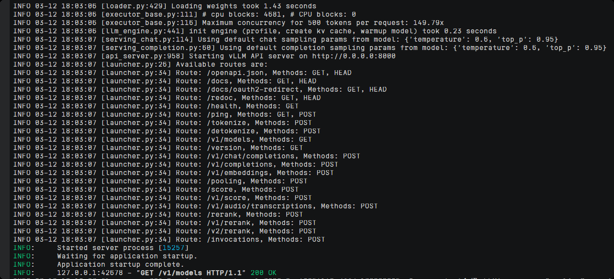

# 购买鲲鹏服务器 
- CPU 64  内存256G  数据盘 300G
## 挂载 磁盘
[参考文档](https://support.huaweicloud.com/usermanual-evs/evs_01_0033.html)
1. 登录云服务器。

2. 查看待初始化的云硬盘的盘符信息。
`lsblk`

3. 执行以下命令获取自动初始化磁盘脚本。<br>
`
wget https://ecs-instance-driver.obs.cn-north-1.myhuaweicloud.com/datadisk/LinuxVMDataDiskAutoInitialize.sh
`

4. 使用脚本对/dev/vdb进行初始化
```shell
chmod +x LinuxVMDataDiskAutoInitialize.sh
./LinuxVMDataDiskAutoInitialize.sh
```

5. 输入盘符如/dev/vdb并回车，脚本将自动执行硬盘的创建分区（/dev/vdb1）与格式化。

6. 对磁盘进行挂载操作，例如输入挂载目录为/data，脚本会自动新建该目录进行挂载操作。
脚本将会自动设置为开机自动挂载。

针对/dev/vdb磁盘分区为/dev/vdb1的初始化成功。


## 软件安装
### Conda
官网下载[MiniConda](https://repo.anaconda.com/miniconda/Miniconda3-latest-Linux-aarch64.sh) 
<br>安装配置环境变量。

### vllm 
[vLLM文档](https://docs.vllm.ai/en/latest/getting_started/installation/cpu.html?device=arm)

### 配置python环境
```shell
conda create -n vllm python=3.12 -y
conda activate vllm
```
### 安装vLLM依赖的gcc 12.3
```commandline
apt-get update  -y
apt-get install -y gcc-12 g++-12 libnuma-dev
update-alternatives --install /usr/bin/gcc gcc /usr/bin/gcc-12 10 --slave /usr/bin/g++ g++ /usr/bin/g++-12
```

### 下载编译vLLM
```commandline
# clone vLLM project:
git clone https://github.com/vllm-project/vllm.git vllm_source
cd vllm_source

# install Python packages for vLLM CPU backend building:
pip install --upgrade pip
pip install "cmake>=3.26" wheel packaging ninja "setuptools-scm>=8" numpy
pip install -v -r requirements/cpu.txt --extra-index-url https://download.pytorch.org/whl/cpu

# build and install vLLM CPU backend:
VLLM_TARGET_DEVICE=cpu python setup.py install
```

根据cpu.txt的内容得出vLLM依赖安装的PyTorch版本为2.5.1 。


### 配置加速
- 使用 TCMalloc 加速库
```commandline
apt-get install libtcmalloc-minimal4 # install TCMalloc library
find / -name *libtcmalloc* # find the dynamic link library path
export LD_PRELOAD=/usr/lib/aarch64-linux-gnu/libtcmalloc_minimal.so.4:$LD_PRELOAD # prepend the library to LD_PRELOAD
```
- 绑定核的时候给服务框架保留1到2个核
```commandline
# 总共32核，绑定30个
export VLLM_CPU_KVCACHE_SPACE=40
export VLLM_CPU_OMP_THREADS_BIND=0-29
```
- 存在超线程时VLLM_CPU_OMP_THREADS_BIND只绑定物理核
```commandline
lscpu -e # check the mapping between logical CPU cores and physical CPU cores

The "CPU" column means the logical CPU core IDs, and the "CORE" column means the physical core IDs. On this platform, two logical cores are sharing one physical core.
CPU NODE SOCKET CORE L1d:L1i:L2:L3 ONLINE    MAXMHZ   MINMHZ      MHZ
0    0      0    0 0:0:0:0          yes 2401.0000 800.0000  800.000
1    0      0    1 1:1:1:0          yes 2401.0000 800.0000  800.000
2    0      0    2 2:2:2:0          yes 2401.0000 800.0000  800.000
3    0      0    3 3:3:3:0          yes 2401.0000 800.0000  800.000
4    0      0    4 4:4:4:0          yes 2401.0000 800.0000  800.000
5    0      0    5 5:5:5:0          yes 2401.0000 800.0000  800.000
6    0      0    6 6:6:6:0          yes 2401.0000 800.0000  800.000
7    0      0    7 7:7:7:0          yes 2401.0000 800.0000  800.000
8    0      0    0 0:0:0:0          yes 2401.0000 800.0000  800.000
9    0      0    1 1:1:1:0          yes 2401.0000 800.0000  800.000
10   0      0    2 2:2:2:0          yes 2401.0000 800.0000  800.000
11   0      0    3 3:3:3:0          yes 2401.0000 800.0000  800.000
12   0      0    4 4:4:4:0          yes 2401.0000 800.0000  800.000
13   0      0    5 5:5:5:0          yes 2401.0000 800.0000  800.000
14   0      0    6 6:6:6:0          yes 2401.0000 800.0000  800.000
15   0      0    7 7:7:7:0          yes 2401.0000 800.0000  800.000

export VLLM_CPU_OMP_THREADS_BIND=0-7
python examples/offline_inference/basic/basic.py
```

- 在具有NUMA的多插槽机器上，设置VLLM_CPU_OMP_THREADS_BIND时避免跨NUMA的内存访问

- 将HTTP服务的组件和Tokenization 的组件分离， **具体怎么做还不知道??**

- NUMA架构采用Tensor Parallel优化，双NUMA节点设置TP=2 对模型进行分片，通常每个NUMA节点视为一张GPU卡。
```commandline
VLLM_CPU_KVCACHE_SPACE=40 VLLM_CPU_OMP_THREADS_BIND="0-31|32-63" vllm serve meta-llama/Llama-2-7b-chat-hf -tp=2 --distributed-executor-backend mp
```
- NUMA架构采用Data Parallel优化，每天NUMA节点启动一个LLM服务端点，启动一个负载均衡器分发请求。
  - nginx、HAProxy
  - [AnyScale Ray](https://docs.ray.io/en/latest/serve/index.html)

### 下载模型
```commandline
# 安装modelscope的客户端工具
pip install modelscope
# 下载模型
modelscope download --model deepseek-ai/DeepSeek-R1-Distill-Qwen-7B  --local_dir /data/models/modelscope/deepseek-ai/DeepSeek-R1-Distill-Qwen-7B/

# 设置模型下载默认路径
export MODELSCOPE_CACHE=/data/models/modelscope
export HF_HOME=/data/models/HuggingFace
export OLLAMA_MODELS=/data/models/ollama

# vLLM默认从HuggingFace下载模型
export VLLM_USE_MODELSCOPE=True
```

### 启动模型
```commandline
# vLLM启动模型如果模型保护路径会寻找本地模型，否则从远端下载，默认从HuggingFace下载，设置环境变量VLLM_USE_MODELSCOPE=True后从ModelScope下载
# 不指定VLLM_CPU_KVCACHE_SPACE或 max-model-len 启动失败
# 指定max-model-len
vllm serve /data/models/modelscope/deepseek-ai/DeepSeek-R1-Distill-Qwen-7B --max-model-len 500

# 设置内存大小40G 
export VLLM_CPU_KVCACHE_SPACE=40  && vllm serve /data/models/modelscope/deepseek-ai/DeepSeek-R1-Distill-Qwen-7B
```


```commandline
# 查看模型信息
curl http://localhost:8000/v1/models

# 启动补全
curl http://localhost:8000/v1/completions \
    -H "Content-Type: application/json" \
    -d '{
        "model": "/data/models/modelscope/deepseek-ai/DeepSeek-R1-Distill-Qwen-7B",
        "prompt": "介绍vLLM",
        "max_tokens": 150,
        "temperature": 0
    }'
    
# 启动聊天
curl http://localhost:11560/v1/chat/completions    -o test.log -H "Content-Type: application/json"     -d '{
        "model": "DeepSeek-R1-Distill-Qwen-14B",
        "messages":[{"role":"user","content": "有一九宫格，右上角已有数字14，请填满不大于15且互不相同的数字，使每横每竖以及对角线三个数字之和为30, 请输出九宫格中所有格子的数字。"}]
    }' 

```